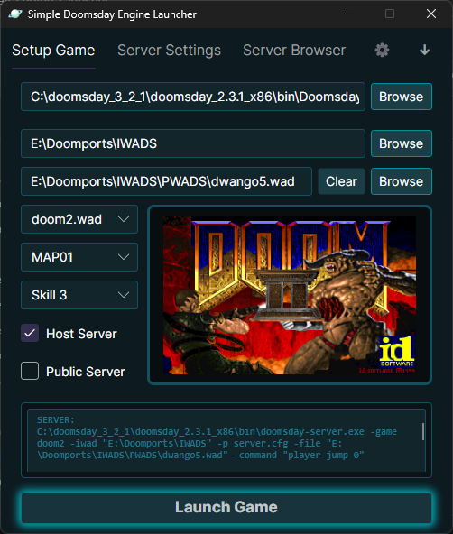
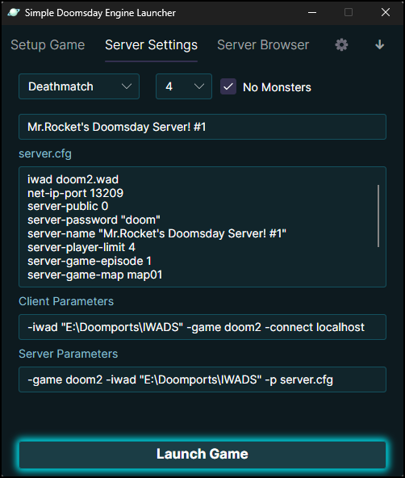
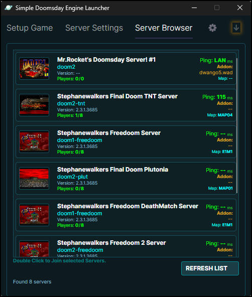
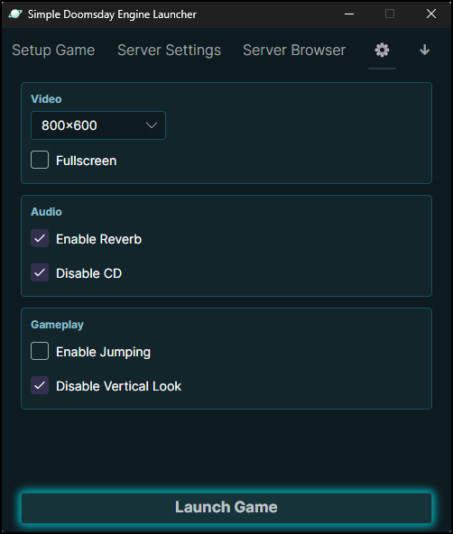
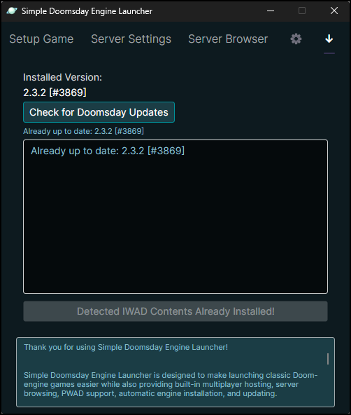

# Simple Doomsday Engine Launcher

A modern, feature-rich launcher and multiplayer browser for the Doomsday Engine built with Avalonia UI and C# .NET 8.

Simple Doomsday Engine Launcher is designed to make launching classic Doom-engine games seamless from your desktop while providing built-in multiplayer hosting, web-coordinated server browsing, automatic PWAD synchronization, and seamless engine updates.

---

## Features

- **Modern UI:** Built on the hardware-accelerated Avalonia UI framework.
- **Automated Engine Management:** Installs and monitors updates for the Doomsday Engine automatically.
- **One-Click Free Content Installer:** Unified downloader directly grabs Doom Shareware and Freedoom Phase 1 & 2, extracting them straight to your game directory.
- **Web-Coordinated Server Browser:** Features a specialized Firebase backend lobby bridge that lists public rooms and lets players bypass tricky local router firewall restrictions for LAN games.
- **Priority Lobby Sorting:** Automatically floats local LAN rooms to the top of your visual grid layout.
- **Getwad Utility Integration:** Automatically scrapes prominent community mirrors (DoomShack, DogSoft, etc.) to download missing custom PWADs when connecting to modified servers.
- **Smart Game Detection:** Automatically indexes local directory trees to populate selectable IWAD list selections, map layouts, and preview thumbnail box-art frames.
- **Multiplayer Control Deck:** Easily adjust game type (Co-op/Deathmatch), max player counts, custom `server.cfg` templates, mapping rules, and skill levels.
- **Advanced Engine Tweaks:** Quick controls for Resolution Scaling (including a native "Launcher Scale" window adaptation), Fullscreen toggles, 3D Reverb, Jumping parameters, and Vertical Mouse Look restrictions.
- **Polished Visual Feedback:** Incorporates dynamic, context-aware glowing UI elements that guide users during first-time setups and flag naming conflicts in real time.

---

## Supported Games

- Doom Shareware
- Ultimate Doom
- Doom II
- TNT: Evilution
- The Plutonia Experiment
- Heretic
- Hexen
- Chex Quest
- Hacx
- Freedoom Phase 1
- Freedoom Phase 2

---

## Screenshots







---

## Requirements

- Windows 10 or newer (Successfully tested on Windows 10 & 11)
- .NET 8 Runtime

---

## Installation

### Prebuilt Release

1. Download the latest release package from the Releases section.
2. Extract the directory anywhere outside of protected system folders (avoid `Program Files`).
3. Launch the main binary executable file: `Simple_Doomsday_Engine_Launcher.exe`

*Recommended setup directory: `C:\Simple Doomsday Engine Launcher`*

> ⚠️ *Note: When running the Launcher for the first time, you may be instructed to download:
> .NET 8.

---

## Building From Source

### Requirements

- Visual Studio 2022
- .NET 8 SDK

### Clone Repository

```bash
git clone https://github.com/MrRocket/Simple-Doomsday-Engine-Launcher.git
```

### Dependencies
The project relies on NuGet to restore the following core libraries:
1. **Avalonia UI** (Cross-platform UI layout library)
2. **CommunityToolkit.Mvvm** (Model-View-ViewModel architecture framework)
3. **Newtonsoft.Json** (High-performance JSON serialization processing framework)

### Database Orchestration Note
This program utilizes a Firebase Realtime Database endpoint to bypass standard UDP socket limits, capturing active session footprints and relaying them back to remote launcher instances. 

> ⚠️ **Important:** For security reasons, the live production database URL link strings have been cleared from the open-source repository layout codebase files. If you fork or build this project from source, you must update the string variables inside your ViewModels with your own private Firebase Realtime Database URL routing endpoint.

### Compile
Open the solution file inside Visual Studio 2022 and compile under the configuration scheme:
```text
Release | x64
```

---

## First Launch Setup

1. Navigate to the Help tab and install the Doomsday Engine directly from the launcher.
2. If you don't own the games yet, click the unified **Download Free Game Content** button to install Doom Shareware and Freedoom.
3. Select your local game files directory folder.
4. Pick your desired IWAD from the dropdown, configure your options profiles, and click **Launch Game**!

---

## Multiplayer Hosting

To host an online match:

1. Navigate to the Server Settings panel and enable "Host Server".
2. Configure your lobby name, game mode parameters, player slots, target map index, and skill parameters.
3. Click the glowing **Launch Game** action button.

The launcher automatically generates a valid layout template configuration for `server.cfg`, handles the initialization execution steps for `doomsday-server.exe`, registers a live heartbeat token on the Firebase lobby server index, and boots your client instance to join the session locally.

---

## Technologies Used

- C#
- Avalonia UI
- .NET 8
- CommunityToolkit MVVM
- Newtonsoft.Json
- Firebase REST API Integration

---

## Credits

### Doomsday Engine Team
This engine wrapper layer is built specifically to support the amazing [Doomsday Engine project](https://dengine.net). Special thanks to the core developers of the engine for keeping classic Doom execution steps modern and accessible.

---

## Legal

DOOM and related game engine intellectual property properties are owned by id Software and Bethesda Softworks. 

This project is an unofficial open-source community launcher development utility and is not affiliated with, endorsed by, or connected to id Software, Bethesda Softworks, or the official Doomsday Engine development team.

---

## License

This project is open-source and licensed under the terms of the [MIT License](LICENSE).
